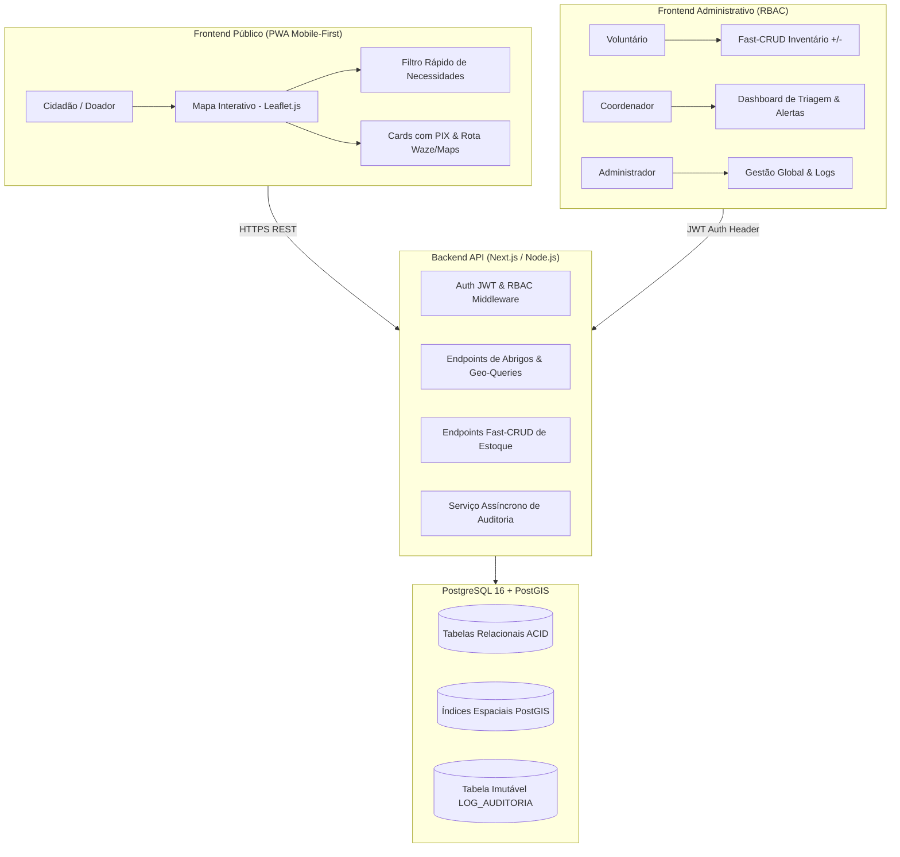

# Arquitetura e Tecnologias - WhereToGo

Baseado na Seção 2 do DVP (Projeto Técnico):

## 1. Arquitetura Utilizada
O projeto adota uma arquitetura **Cliente-Servidor (Client-Server)** estruturada em monólito modular ou microsserviços com separação clara de responsabilidades via API RESTful:

---

## 2. Tecnologias e Ferramentas

| Tecnologia | Versão | Objetivo e Justificativa Técnica |
|---|---|---|
| **Next.js / React** | 16 (ou 14+) | Front-end e rotas de API full-stack. SSR/SSG otimizado para carregamento instantâneo do mapa público e Painel Administrativo. |
| **Node.js** | 20+ / 22+ | Runtime para a API assíncrona, com alto throughput de requisições de I/O (ideal para as chamadas frequentes do Fast-CRUD). |
| **PostgreSQL** | 16 | Banco de dados relacional robusto com conformidade ACID e integridade referencial para estoque e logs imutáveis. |
| **PostGIS** | 3.4+ | Extensão geoespacial do PostgreSQL para cálculos espaciais de alta performance (proximidade de abrigos, coordenadas geográficas). |
| **Leaflet.js** | Mais recente | Renderização de mapas ultra-leve, consumindo significativamente menos banda e dados móveis do que bibliotecas proprietárias pesadas. |
| **JWT (JSON Web Token)** | RFC 7519 | Autenticação stateless com claims de papéis (RBAC) e associação de abrigo. |
| **Docker & Docker Compose** | Multi-stage | Padronização e isolamento completo de ambiente de desenvolvimento e produção com Postgres + PostGIS. |
