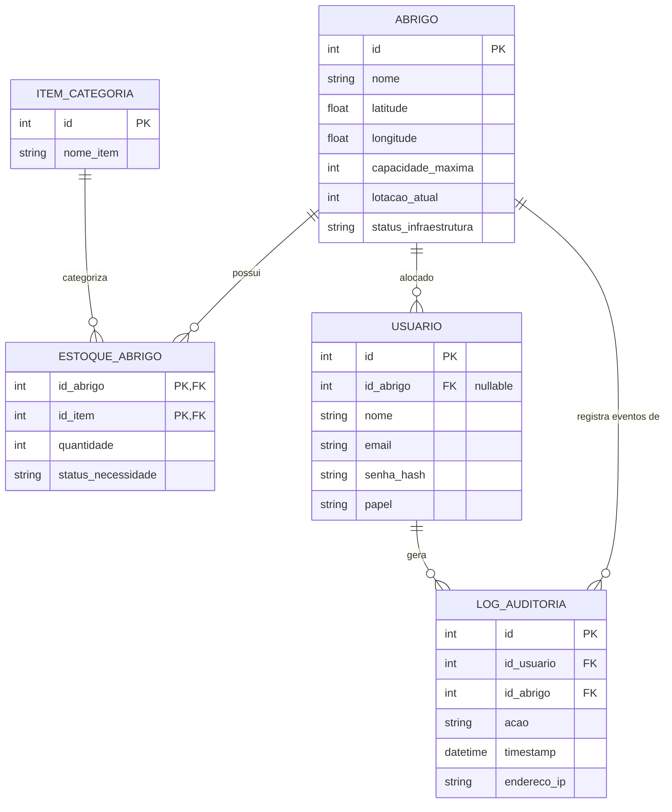

# Modelo Lógico do Banco de Dados - WhereToGo

Conforme definido na Seção 2.3 do Documento de Visão do Produto:

## 1. Diagrama de Entidade-Relacionamento

---

## 2. Detalhamento das Tabelas e Atributos

### 2.1. `ABRIGO`
Armazena os abrigos emergenciais cadastrados.
- `id` (INT, PK, Auto Increment)
- `nome` (VARCHAR)
- `latitude` (FLOAT / GEOMETRY Point via PostGIS)
- `longitude` (FLOAT / GEOMETRY Point via PostGIS)
- `capacidade_maxima` (INT, capacidade total de acolhimento)
- `lotacao_atual` (INT, quantidade atual de pessoas abrigadas)
- `status_infraestrutura` (VARCHAR, ex: "NORMAL", "SEM_ENERGIA", "VIA_COLAPSADA", etc.)

### 2.2. `ITEM_CATEGORIA`
Catálogo global de itens e suprimentos disponíveis para doação/estocagem.
- `id` (INT, PK, Auto Increment)
- `nome_item` (VARCHAR, ex: "Água Potável 5L", "Cesta Básica", "Medicamento Básico", "Cobertor")

### 2.3. `ESTOQUE_ABRIGO`
Tabela associativa que controla a quantidade de cada item em cada abrigo e sua criticidade.
- `id_abrigo` (INT, PK, FK -> `ABRIGO.id`)
- `id_item` (INT, PK, FK -> `ITEM_CATEGORIA.id`)
- `quantidade` (INT, não-negativo >= 0)
- `status_necessidade` (VARCHAR, domínio: `'URGENTE'`, `'NORMAL'`, `'BLOQUEADO'`)

### 2.4. `USUARIO`
Usuários do sistema interno (com controle RBAC).
- `id` (INT, PK, Auto Increment)
- `id_abrigo` (INT, FK -> `ABRIGO.id`, opcional/nulo para Administrador Geral)
- `nome` (VARCHAR)
- `email` (VARCHAR, Unique)
- `senha_hash` (VARCHAR, hash bcrypt/argon2)
- `papel` (VARCHAR / ENUM: `'ADMIN'`, `'COORDENADOR'`, `'VOLUNTARIO'`)

### 2.5. `LOG_AUDITORIA`
Tabela imutável (append-only) para auditoria rigorosa de todas as alterações de estoque e status (RNF03).
- `id` (INT, PK, Auto Increment)
- `id_usuario` (INT, FK -> `USUARIO.id`)
- `id_abrigo` (INT, FK -> `ABRIGO.id`)
- `acao` (VARCHAR, ex: `"+1 Água Potável"`, `"-5 Cestas Básicas"`, `"STATUS_ALTERADO: URGENTE"`)
- `timestamp` (TIMESTAMP WITH TIME ZONE, gerado automaticamente no insert)
- `endereco_ip` (VARCHAR, IP de origem da requisição)
